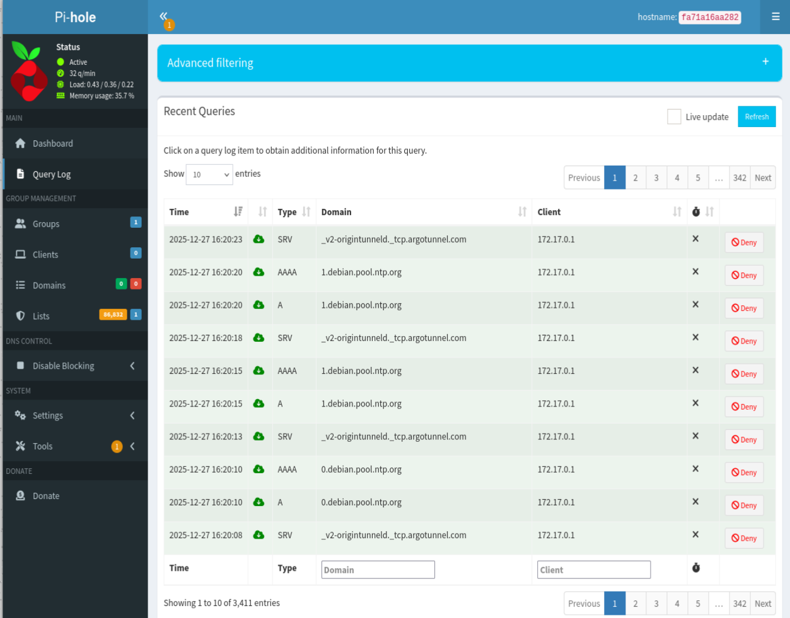
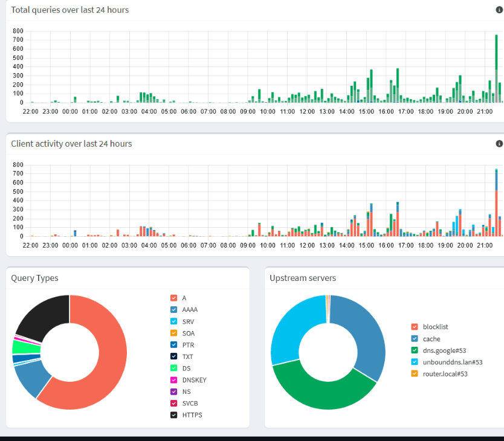

<<<<<<< HEAD
=======
<<<<<<< HEAD
# Pi-hole_DNSFirewall_-_AdBlocker
A Docker-based Pi-hole setup that provides "network-wide ad blocking, tracker prevention, and DNS-level security".
=======
>>>>>>> eb2ce1d (Add Pi-hole DNS firewall configs)
# 🚀 Pi-hole: Network-wide DNS Firewall & Ad Blocker

A high-performance, Docker-based DNS sinkhole designed for **Network-wide Ad Blocking**, **Tracker Prevention**, and **DNS-level Security**.

---

## 📖 Project Overview

This setup transforms your Kali Linux VM or local server into a powerful **DNS Firewall (IDS-lite)**. By intercepting DNS queries at the network level, it prevents malicious domains from ever being resolved, providing a proactive layer of defense for all connected devices.

---

## 🧠 Core Capabilities

### 🛡️ Level 1: Essential Protection

- **Network-wide Blocking**: Block ads on devices that can't run traditional browser extensions, such as Smart TVs, Mobile Apps, IoT devices, and Gaming Consoles.
- **Reduced Telemetry**: Dramatically reduce background data "phone-home" tracking from Google, Xiaomi, and Samsung services.
- **Custom Blocklists**: Automatically sync with high-quality community sources to block:
  - Malware & Phishing 🎣
  - Crypto-miners 🪙
  - Social Media & Gambling 🃏

### 🔒 Level 2: Security & Blue-Teaming

- **DNS Firewall**: Detect and drop Command-and-Control (C2) traffic at the DNS layer before a connection is even established.
- **Per-Device Policies**: Apply different rules for different users (e.g., block YouTube on TV, but allow on Laptop).
- **Log Analysis**: Export query data to Python, ELK, or Grafana for deep security audits and traffic visualization.

---

## 🛠️ Tech Stack & Requirements

<div align="center">

| Component | Technology |
|:---------:|:----------:|
| **Core Engine** | Pi-hole Official Docker Image |
| **Platform** | Linux (Tested on Kali Linux 2024.x) |
| **Containerization** | Docker & Docker Compose |
| **Networking** | Port 53 (DNS), 80 (Admin UI), 443 (HTTPS) |

</div>

---

## 📸 Dashboard Preview

<div align="center">

| Feature | Description |
|:-------:|:-----------:|
| **Real-time Stats** | Total queries, blocked domains, and percentage of ads filtered. |
| **Query Log** | Live view of every DNS request hitting your network. |
| **Group Management** | Assign clients to specific "Block-Profiles." |

</div>

<div align="center">

### 🖥️ Screenshots

#### Pi-hole Admin Dashboard

*Real-time statistics and monitoring interface*

#### DNS Query Log

*Live DNS request monitoring and filtering*

#### Blocklist Management

*Custom blocklist configuration and management*

#### Network Statistics

*Detailed analytics and client-wise filtering stats*

</div>

---

## 🚀 Quick Setup

### 1. Prerequisites

Ensure `systemd-resolved` is not occupying port 53, as Pi-hole needs this port to listen for DNS requests:

```bash
# Stop and disable the conflicting service
sudo systemctl stop systemd-resolved
sudo systemctl disable systemd-resolved
```

---

### 🔧 Fix DNS Conflicts Using `nmcli` (Proper Method)

If you're experiencing DNS conflicts or connection issues, follow these steps to properly configure DNS using NetworkManager.

#### 🔍 Step 1: Identify Active Connection

```bash
nmcli con show --active
```

**Example output:**
```
Wired connection 1
```
or
```
Wired connection 2
```

👉 **Note the connection name exactly.**

---

#### 🛑 Step 2: Remove Auto DNS from NetworkManager

Replace `Wired connection 1` with your actual connection name:

```bash
sudo nmcli con mod "Wired connection 1" ipv4.ignore-auto-dns yes
sudo nmcli con mod "Wired connection 1" ipv6.ignore-auto-dns yes
```

---

#### 🌐 Step 3: Set Manual DNS

**Option A: Google DNS**
```bash
sudo nmcli con mod "Wired connection 1" ipv4.dns "8.8.8.8 8.8.4.4"
```

**Option B: Cloudflare DNS**
```bash
sudo nmcli con mod "Wired connection 1" ipv4.dns "1.1.1.1 1.0.0.1"
```

---

#### 🔄 Step 4: Restart the Connection

```bash
sudo nmcli con down "Wired connection 1"
sudo nmcli con up "Wired connection 1"
```

**Or simply restart NetworkManager:**
```bash
sudo systemctl restart NetworkManager
```

---

#### ✅ Step 5: Verify DNS Configuration

**Check via nmcli:**
```bash
nmcli dev show | grep DNS
```

**Expected output:**
```
IP4.DNS[1]: 8.8.8.8
IP4.DNS[2]: 8.8.4.4
```

**Check resolv.conf:**
```bash
cat /etc/resolv.conf
```

**You should see:**
```
nameserver 8.8.8.8
nameserver 8.8.4.4
```

---

#### 🧪 Test DNS Resolution

```bash
nslookup google.com
```

**OR**

```bash
dig google.com
```

If it resolves → **DNS fixed** ✅

---

#### 🔥 Why This Fix Works

- `resolv.conf` is auto-generated and gets overwritten
- NetworkManager controls DNS at the system level
- `nmcli` modifies DNS at the **source** (NetworkManager)
- This prevents **Pi-hole DNS loops** & **Docker DNS failures**

---

#### 🧠 Bonus: Switch to Pi-hole DNS Later

After Pi-hole is stable and running, point DNS to your local Pi-hole instance:

```bash
sudo nmcli con mod "Wired connection 1" ipv4.dns "127.0.0.1"
sudo nmcli con up "Wired connection 1"
```

---

### 2. Installation

Clone this repository and run the automated deployment script:

```bash
# Make the script executable
chmod +x pihole.sh

# Run the installer
./pihole.sh
```

### 3. Connect Your Devices

To start filtering traffic, point your devices to the IP address of your Kali VM.

<div align="center">

| Device | Step |
|:------:|:----:|
| **Router** | Change LAN DNS settings to your `Kali_VM_IP`. |
| **Windows** | Network Settings → IPv4 → DNS → Manual → `Kali_VM_IP`. |
| **Mobile** | Wi-Fi Settings → IP Settings: Static → DNS 1: `Kali_VM_IP`. |

</div>

---

## 🛡️ Recommended Blocklists (Security Mode)

Add these URLs to your **Adlists** settings within the Pi-hole dashboard for maximum security:

- **General Ads**: `https://raw.githubusercontent.com/StevenBlack/hosts/master/hosts`
- **Malware/Phishing**: `https://urlhaus.abuse.ch/downloads/hostfile/`
- **Pro-Privacy (Hagezi)**: `https://raw.githubusercontent.com/hagezi/dns-blocklists/main/adblock/pro.txt`

---


## 👤 Author

**Pranav Dakle**  
Specializing in DevOps, Cybersecurity, & IoT

[](https://github.com/pranavdaklepatil)

---
<<<<<<< HEAD
=======
>>>>>>> 425af3a (REDMI.md updated)
>>>>>>> eb2ce1d (Add Pi-hole DNS firewall configs)
